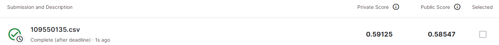

# NYCU 2022 Introduction to Machine Learning Final Project

## Environment
* python: 3.10.5
* tesorflow: 2.11.0
* keras: 2.11.0

## Process of reproducing the work
* First install following packages(for google colab)
```bash
!pip install -q keras
!pip install tensorflow
```
* Input data is in the same directory as two ipynb files , you can move them to desired places and specify the path in the two ipynb files just mentioned , the place to adjust is commented

* To reproduce `109550135.csv`(file for submission) without retraining :
1. Download [Pretrained Model](https://drive.google.com/file/d/1Jbzr1SQ-iFxKGfbqNFEFfhpfu1-Er1wH/view?usp=share_link) 
3. Put the downloaded model file in the same directory as `109550135_Final_inference.ipynb`
2. Run `109550135_Final_inference.ipynb`

* To reproduce `109550135.csv`(file for submission) from the beginning :
1. Run `109550135_Final_train.ipynb` and get `109550135_model.h5`
2. `109550135_model.h5` will be in the same directory as `109550135_Final_train.ipynb` and `109550135_Final_inference.ipynb`
3. So you can run `109550135_Final_inference.ipynb` directly
4. A `109550135.csv` will be created in the same directory as two ipynb files , it's the result for submission


## Train the model
  Once you create the environment, you can run `109550135_Final_train.ipynb` for training the model.

  Of course , you can skip the former step and use `109550135_Final_inference.ipynb` directly to evaluate performace of the model
>P.S. Don't forget to download [Pretrained Model](https://drive.google.com/file/d/1Jbzr1SQ-iFxKGfbqNFEFfhpfu1-Er1wH/view?usp=share_link) to the same directory as `109550135_Final_train.ipynb` first, then you can run `109550135_Final_inference.ipynb`.

## Evaluate model performance
  Evaluate model performace by `109550135_Final_inference.ipynb`.

  If you want to evaluate the model performance without retraining , you need to download [Pretrained Model](https://drive.google.com/file/d/1Jbzr1SQ-iFxKGfbqNFEFfhpfu1-Er1wH/view?usp=share_link) to the same directory as `109550135_Final_train.ipynb` first, then run `109550135_Final_inference.ipynb`.

## Prediction result
  After finishing evalutaing the model by `109550135_Final_inference.ipynb`, you will get `109550135.csv` , which is the result you need .

The below is the accuracy result:


| Submission         | Private Score   | Public Score   |
| ------------------ |---------------- | -------------- |
| 109550135.csv     |     0.59125     |      0.59547   |
